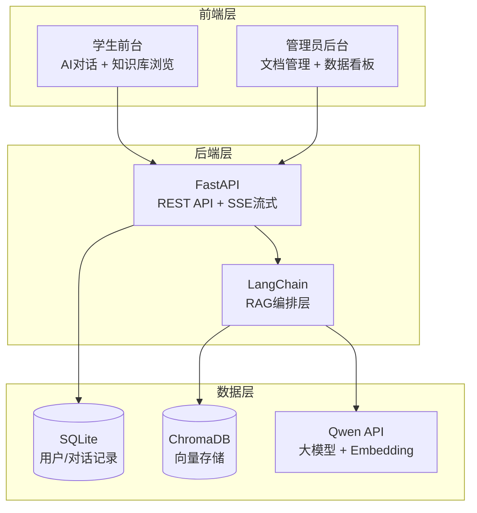

# 🎓 校园智能 AI 助手 — 基于 RAG 的知识库问答系统

面向大学校园的 AI 智能问答应用。上传校园文档构建私有知识库，学生用自然语言提问，系统检索相关知识 + 大模型生成精准回答。

**核心价值**：解决通用大模型"不懂你们学校"的问题 — 私有知识库 + RAG = 准确、可溯源的回答。

---

## 📸 效果展示

| AI 对话（流式输出 + 答案溯源） | 管理员后台 |
|:---:|:---:|
|  |  |

| 登录页 | 数据看板 |
|:---:|:---:|
|  |  |

---

## 🏗 系统架构



## 🔄 RAG 工作流

```
上传文档 → 文本解析 → 切片(500字/片) → 向量化(Embedding) → 存入ChromaDB
                                                              ↓
用户提问 → 向量检索 → 召回Top-3相关片段 → 拼接Prompt → 大模型生成 → SSE流式返回
                                                              ↓
                                              答案溯源 + 反馈收集
```

---

## ✨ 功能

### 学生端
- 🤖 **AI 智能问答**：支持流式输出（SSE），逐字显示
- 📎 **答案溯源**：每个回答标注引用来源，默认展开展示原文片段
- 💬 **多轮对话**：保存上下文，连续追问
- 📚 **知识库浏览**：查看已上传的校园文档列表
- 📥 **对话导出**：支持 Markdown 格式导出
- 👍 **反馈系统**：赞/踩评价，收集答案质量
- 🌙 **暗色模式**：支持亮/暗主题切换
- ⚡ **快捷提问**：预设校园高频问题

### 管理员后台
- 📁 **知识库管理**：上传 PDF/TXT 文档，自动解析切片向量化
- 📊 **数据看板**：提问总量、活跃用户、好评率统计
- ⚙️ **模型配置**：支持 Qwen/Claude/DeepSeek/Gemini/Ollama 动态切换
- 🎛️ **参数调节**：Temperature、Top-P、MaxTokens 实时生效

---

## 🛠 技术栈

| 层 | 技术 |
|---|------|
| 后端框架 | **Python + FastAPI** |
| AI 框架 | **LangChain**（RAG 编排） |
| 向量数据库 | **ChromaDB**（持久化模式） |
| 大模型 | **Qwen-Plus**（通义千问，默认） |
| Embedding | **text-embedding-v3**（DashScope） |
| 业务数据库 | **SQLite** |
| 文档解析 | **PyPDF2** |
| 前端 | **HTML + CSS + Bootstrap + Vanilla JS** |

---

## 🚀 本地运行

### 1. 安装依赖
```bash
cd backend
pip install -r requirements.txt
```

### 2. 配置 API Key
```bash
# 设置环境变量（或直接编辑 backend/config.py）
export DASHSCOPE_API_KEY="你的阿里云百炼API_Key"
```

### 3. 启动后端
```bash
cd backend
uvicorn main:app --host 127.0.0.1 --port 8001 --reload
```

### 4. 启动前端
```bash
cd frontend
python -m http.server 3000
```

### 5. 打开浏览器
```
http://127.0.0.1:3000/student/login.html
```

### 演示账号
| 角色 | 用户名 | 密码 |
|------|--------|------|
| 学生 | student | 123456 |
| 管理员 | admin | admin123 |

---

## 📁 项目结构

```
campus-ai-assistant/
├── backend/                     # Python 后端
│   ├── main.py                  # FastAPI 入口
│   ├── config.py                # 全局配置
│   ├── database.py              # SQLite + 数据模型
│   ├── routes/                  # API 路由
│   │   ├── auth.py              #   登录/注册
│   │   ├── chat.py              #   AI对话(含SSE流式)
│   │   ├── documents.py         #   文档上传/管理
│   │   ├── stats.py             #   数据统计
│   │   └── settings.py          #   模型配置
│   ├── services/
│   │   └── rag_service.py       #   RAG核心(检索+生成)
│   ├── chroma_data/             #   向量持久化
│   └── uploads/                 #   上传文档
│
├── frontend/                    # 前端
│   ├── student/                 #   学生端
│   │   ├── login.html           #     统一登录
│   │   ├── index.html           #     AI对话页面
│   │   ├── history.html         #     个人中心
│   │   ├── css/style.css        #     全局样式
│   │   └── js/                  #     JS
│   └── admin/                   #   管理员后台
│       ├── index.html           #     数据看板
│       ├── documents.html       #     知识库管理
│       └── settings.html        #     模型配置
│
└── README.md
```

